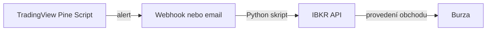

# Python Flask aplikace

- [Python Flask aplikace](#python-flask-aplikace)
  - [Jak spustit aplikaci](#jak-spustit-aplikaci)
  - [Stránka](#stránka)
- [Obchodování](#obchodování)
  - [Slovníček pojmů](#slovníček-pojmů)
  - [Algoritmické obchodování - platformy](#algoritmické-obchodování---platformy)
    - [💻 Pine Script](#-pine-script)
    - [🧠 TradingView](#-tradingview)
    - [🏦 IBKR (Interactive Brokers)](#-ibkr-interactive-brokers)
  - [TradingView](#tradingview)
    - [Pine Scriptu](#pine-scriptu)
      - [Jak ho použít:](#jak-ho-použít)
  - [IBKR - Interactive Brokers](#ibkr---interactive-brokers)
    - [IBKR API](#ibkr-api)
      - [Příklad integrace v praxi](#příklad-integrace-v-praxi)
  - [Backtesting](#backtesting)
    - [Hotové softwary pro backtesting](#hotové-softwary-pro-backtesting)
    - [Knihovny pro backtesting v Pythonu](#knihovny-pro-backtesting-v-pythonu)
      - [Ukázka s Backtesting.py](#ukázka-s-backtestingpy)
    - [Profesionální frameworky](#profesionální-frameworky)
    - [Backtesting v TradingView](#backtesting-v-tradingview)
      - [Co TradingView backtesting umí](#co-tradingview-backtesting-umí)
      - [Omezení TradingView backtestingu](#omezení-tradingview-backtestingu)
      - [Shrnutí](#shrnutí)
  - [Algoritmické obchodování - propojení platforem](#algoritmické-obchodování---propojení-platforem)
    - [Přímé propojení přes Python + IBKR API](#přímé-propojení-přes-python--ibkr-api)
    - [Krok po kroku:](#krok-po-kroku)

## Jak spustit aplikaci

1. Ujistěte se, že máte nainstalované všechny potřebné knihovny uvedené v `requirements.txt`.
2. Spusťte aplikaci pomocí příkazu:

   ```bash
   python app.py
   ```

## Stránka

Webová stránka bude dostupná na [http://127.0.0.1:5000/](http://127.0.0.1:5000/) ve vašem prohlížeči.

# Obchodování

- Jak vytvořit trading bota?
  - Jak vytvořit strategii v Pine Scriptu?
  - Jak udělat analýzu obchodu na historických datech (aka backtesting)?
  - Odesílání příkazů:
    - email/discord/webhook?
    - na burzu (IBKR API)?
- Jak otestovat Bota v paper tradingu?
- Ostré obchodování
- Jak vytvořit nekorelované portfolio?
  - Výpočet korelace mezi strategiemi v backtestu

## Slovníček pojmů
- **Broker** - prostředník pro obchodování na burze.
  - **IBKR** - Interactive Brokers, a je to jedna z největších a nejrespektovanějších broker společností na světě.
- **Systematické obchodování** - obchodování na základě předem definovaných pravidel.
- **Algoritmické obchodování** - obchodování pomocí počítačových programů.
- **Paper trading** - simulované obchodování bez reálných peněz.
- **Backtesting** - testování obchodní strategie na historických datech.

Algoritmické obchodování v praxi

## Algoritmické obchodování - platformy

```css
[ Pine Script ] → analýza, indikátory
        ↓
[ TradingView ] → vizualizace, testování, alerty
        ↓
[ IBKR ] → reálné obchodování (příkazy na burze)
```

| Nástroj                           | Co to je                            | K čemu se používá                                         | Příklad použití                                        |
| --------------------------------- | ----------------------------------- | --------------------------------------------------------- | ------------------------------------------------------ |
| 🧠 **TradingView**                | Webová platforma                    | Vizualizace grafů, analýzy, skripty                       | Sleduješ BTC/USD graf a spouštíš Pine Script indikátor |
| 💼 **IBKR (Interactive Brokers)** | Broker (obchodník s cennými papíry) | Reálné obchodování s akciemi, futures, forexem atd.       | Zadáš příkaz: „kup 10x AAPL“                           |
| 💻 **Pine Script**                | Programovací jazyk (od TradingView) | Tvorba indikátorů, strategií a alertů přímo v TradingView | Napíšeš skript, který ukazuje kdy nakoupit/prodat      |

### 💻 Pine Script

Je to jazyk používaný výhradně v TradingView.

- něco jako „mini-jazyk pro trhy“,
- používá se pro tvorbu indikátorů, strategií a alertů,
- nelze ho použít mimo TradingView (např. v Pythonu nebo IBKR).

> [!note] 📌 Typické použití:
„Chci indikátor, který ukáže, když Williams %R překročí 80.“

✅ Výhody:
- jednoduchý syntax,
- běží přímo v prohlížeči,
- rychlý backtest.

### 🧠 TradingView

Je to webová platforma pro analýzu trhů:

- přístupná z prohlížeče (žádná instalace),
- obsahuje grafy, indikátory, alerty a backtesting,
- můžeš si tam psát vlastní skripty v jazyce Pine Script.

> [!note] 📌 Typické použití:
„Chci sledovat RSI a MACD na grafu Bitcoinu a upozornění, když RSI < 30.“


### 🏦 IBKR (Interactive Brokers)

IBKR je reálný broker:
- drží tvé peníze a pozice,
- provádí příkazy na burze,
- má přístup k reálným tržním datům,
- má vlastní desktop aplikaci (TWS) a API pro automatizaci (např. Python).

> [!note] 📌 Typické použití:
„Můj Python bot pomocí IBKR API nakupuje akcie AAPL, když 10denní SMA překročí 50denní SMA.“

✅ Přednosti:
- přímé propojení s burzami,
- reálné i simulované obchodování (paper trading),
- přístup k téměř všem trhům na světě.

## TradingView

[API Reference](https://www.tradingview.com/charting-library-docs/latest/api/)

### Pine Scriptu

Pine Script je jazyk pro skriptování, který se používá v TradingView pro vytváření vlastních indikátorů a strategií.

[Script Library](https://www.tradingview.com/scripts/)

[YouTube: The Art of Trading](https://www.youtube.com/@TheArtOfTrading)

#### Jak ho použít:

1. V TradingView otevři Pine Editor (dole na obrazovce).
2. Klikni na “Open” → “Upload from computer” a vyber svůj .pine soubor.
(Nebo prostě zkopíruj celý kód a vlož ho ručně do editoru.)
3. Ulož (Ctrl + S) a klikni na “Add to chart”.

> [!note] 📌 Poznámka: 
> TradingView používá Pine Script pouze uvnitř své platformy – tedy i když máš soubor s příponou .pine, mimo TradingView (např. v Pythonu nebo v jiném IDE) ho nespustíš.
> Slouží čistě jako přenosný formát kódu mezi uživateli TradingView.

## IBKR - Interactive Brokers

### IBKR API

IBKR má API (rozhraní), přes které můžeš:

- 📡 napojit Python kód nebo backtestovací framework (např. Zipline, QuantConnect, Backtrader),
- 🧮 posílat reálné příkazy na burzu (market, limit, stop...),
- 🔁 synchronizovat data a portfolio,
- 💾 stahovat historická i živá data pro backtesting.

#### Příklad integrace v praxi

Pokud bys měl hotovou strategii v Pythonu, můžeš ji přes IBKR API napojit takto:

```python
from ib_insync import *

ib = IB()
ib.connect('127.0.0.1', 7497, clientId=1)  # Připojení k TWS nebo IB Gateway

contract = Stock('AAPL', 'SMART', 'USD')
ib.reqMktData(contract, '', False, False)
```


## Backtesting

### Hotové softwary pro backtesting
| software | cena |
|----------|------|
| [RealTest](https://mhptrading.com/) | $389 USD |

### Knihovny pro backtesting v Pythonu

| Knihovna   | Výhody    | Poznámka       |
| -------------------------- | ------------------------------------- | --------------------------------- |
| **Backtrader**             | robustní, komunita, vizualizace       | klasika, trochu těžkopádný kód    |
| **vectorbt / vectorbtpro** | superrychlý (NumPy, Numba), elegantní | ideální pro kvanty                |
| **bt (by pmorissette)**    | jednoduchý, funkcionální styl         | méně kontroly nad exekucí         |
| **zipline**                | dříve Quantopian                      | zastaralý, ale dobrý konceptuálně |
| **Backtesting.py**         | velmi přehledný, čistý kód            | ideální pro začátek               |

#### Ukázka s Backtesting.py

```python
from backtesting import Backtest, Strategy
from backtesting.lib import crossover
import yfinance as yf

data = yf.download("AAPL", start="2020-01-01")

class SmaCross(Strategy):
    n1 = 20
    n2 = 50

    def init(self):
        close = self.data.Close
        self.sma1 = self.I(close.rolling, self.n1).mean()
        self.sma2 = self.I(close.rolling, self.n2).mean()

    def next(self):
        if crossover(self.sma1, self.sma2):
            self.buy()
        elif crossover(self.sma2, self.sma1):
            self.sell()

bt = Backtest(data, SmaCross, cash=10_000, commission=.002)
stats = bt.run()
bt.plot()
print(stats)
```

### Profesionální frameworky

Když už chceš testovat portfolio strategií, ticková data, nebo režimy exekuce.

Příklady:
- **Zipline** / **Zipline-live** – integrovatelné s **IBKR**
- **QuantConnect** - (cloud-based, Python + C#) – má i reálné nasazení
- **vectorbtpro** - GPU-akcelerovaný, ideální pro optimalizace

### Backtesting v TradingView

Základní struktura Pine Script strategie:
```pinescript
//@version=5
strategy("SMA Crossover", overlay=true, initial_capital=10000, default_qty_type=strategy.percent_of_equity, default_qty_value=10)

sma20 = ta.sma(close, 20)
sma50 = ta.sma(close, 50)

if ta.crossover(sma20, sma50)
    strategy.entry("Long", strategy.long)

if ta.crossunder(sma20, sma50)
    strategy.close("Long")
```

`strategy()` místo `study()` = backtesting mód.

`strategy.entry()` = otevírá simulovaný obchod.

`strategy.close()` = zavírá obchod.

TradingView automaticky počítá: zisky, ztráty, drawdown, výkonnostní metriky.

#### Co TradingView backtesting umí

Simulace historických obchodů podle definované strategie. Vizualizace equity křivky přímo na grafu.

Výpočty:
- Net profit, % zisku
- Max drawdown
- Počet obchodů, win rate
- Sharpe ratio

Můžeš nastavit:
- kapitál,
- velikost pozice (% účtu),
- komise a poplatky,
- režim market/limit order.

#### Omezení TradingView backtestingu
| Omezení	| Co to znamená |
| --------- | -------------------------------------|
| Pine Script	| Backtesting jen v rámci Pine Scriptu, žádné externí API |
| Candle close	| Obchody jsou často simulovány na **close svíčky**, ne intraday |
| Data	| Historie je dostupná jen podle plánu (některé data jen pár let) |
| Portfolio	| ⚠️ Nelze backtestovat více aktiv dohromady s plnou interakcí (multi-asset strategie jsou omezené) |

#### Shrnutí
- ✅ TradingView = rychlý způsob, jak backtestovat strategie přímo na grafu.
- ✅ Vhodné pro indikátory a jednoduché strategie.
- ⚠️ Omezené pro portfolio strategie, ticková data nebo kompletní simulaci reálného účtu.

> [!note]
> Pokud chceš *realistický backtest* s více aktivy a pozicemi, budeš potřebovat **Python** + knihovnu (např. **Backtrader**, **vectorbt**).

## Algoritmické obchodování - propojení platforem

Omezení TradingView je v tom, že Pine Script běží jen na serverech TradingView. Může generovat signály a alerty, ale nemá API, které by přímo provádělo obchody u brokera.

> [!warning] Nelze
> tedy napsat Pine Script → kliknout „Buy“ → a IBKR provede příkaz automaticky.

✅ Co Pine Script umí:
- generovat alerty (např. e-mail, webhook, notifikaci).

### Přímé propojení přes Python + IBKR API

Pokud chceš automatizaci, musíš vzít TradingView signál → Python skript → IBKR API → reálný obchod.

Obvykle to funguje takto:



### Krok po kroku:

1. TradingView Pine Script

```pinescript
if crossover(sma20, sma50)
    alert("BUY_SIGNAL", alert.freq_once_per_bar_close)
```

Generuje alert „BUY_SIGNAL“ na konci svíčky.

2. TradingView webhook

```json
{
    "alert": "BUY_SIGNAL"
}
```

Nastavíš alert, který posílá HTTP POST request na tvůj Python server nebo cloud funkci (např. Flask).

3. Python skript přijme webhook

```python
from flask import Flask, request
from ib_insync import *

app = Flask(__name__)
ib = IB()
ib.connect('127.0.0.1', 7497, clientId=1)

@app.route('/tv_alert', methods=['POST'])
def tv_alert():
    data = request.json
    if data['alert'] == 'BUY_SIGNAL':
        contract = Stock('AAPL', 'SMART', 'USD')
        ib.placeOrder(contract, MarketOrder('BUY', 10))
    return "OK"

app.run(port=5000)
```

4. IBKR API provede obchod

Skript dostane signál a vytvoří příkaz přes [**IBKR TWS**](https://www.interactivebrokers.com/en/trading/tws.php) nebo **IB Gateway**.